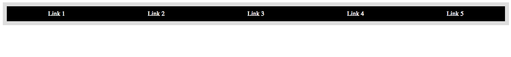

##Lesson 05 - Startup Matchmaker

###Pre-lesson

Install Hipchat!

###Learning Objectives

*	Practice web development by transforming a design comp into an HTML and CSS web page.

###Schedule


| Time        | Topic| GA ICLs| Comments |
| ------------- |:-------------|:-------------------|:----------------|
| 180 min | Lab Session | Startup Match Maker | Students build a site with little guidance on how to start. |


---

##Review

* How was homework? Who wants to demo?
* Questions? Common issues?
	
<br><br>

##Review display

The `display` property can take 4 values:

* __inline__ (eg. a, span, strong, em)
* __block__ (eg. div, p, h1, article, nav)
* __inline-block__
* __none__

`span`s are always `display: inline;`. `div`s are always `display: block;`.

You can't apply width to inline elements, it doesn't do anything!

You also can't apply any vertical margins. (But left and right are allowed).

Inline-block exercise: [http://codepen.io/pen/def?fork=felqd](http://codepen.io/pen/def?fork=felqd)

Inline-block challenge: [http://codepen.io/pen/def?fork=hKIBx](http://codepen.io/pen/def?fork=hKIBx)

Make it look like this:


Note that inline and inline-block elements respect whitespace!

##Review floats and clearing

* Floated elements are pushed to the left or right side of their container.
* Other content flows around floats.

### Problem 1: I want content to go below a floated item, not to smoosh up next to it!
* To stop content from flowing around a floated element, we can add the `clear` CSS rule to the *content* (__not__ the floated element!).
  * Hint: Generally you clear in the same direction as you're floating: if you're floating left, you'll want to `clear: left;`. You can also `clear: both;`.
* Instead of adding `clear` to multiple css rules, it's often cleaner to make a general-purpose utility class:
``` css
  .clear {
    clear: both;
  }
```

### Problem 2: Floated items are spilling out of my container (div)!
* Containers (block level) will always be *as wide* as they can be, and *as tall* as they can be.
  * This is determined by the css width and height, or otherwise by the contents of the container.
* When you float elements you remove them from their normal flow. In other words, they stop taking up their normal-flow "space", and appear to fall out of their container.
* Alas, how can we reconcile this falling out!?
* Behold, the `clearfix` hack:
  * 1) Place a block-level element in the container, __after__ all the floating content.
  * 2) Clear it (see above).
  * In other words, put something non-floated, that your container can "see," inside your container, and tell it to go after (i.e. `clear`) all the floating stuff!
* The fancy shmancy way of doing this is with a css utility class that uses the `:after` css psuedo-selector:
``` css
  .clearfix:after {
     content: ".";
     display: block;
     clear: both;
     visibility: hidden;
     line-height: 0;
     height: 0;
  }
```


###Exercise
* Open [http://codepen.io/pen/def?fork=mtcsf](http://codepen.io/pen/def?fork=mtcsf)
* Float the image left.
* Apply `clear: left;` to the paragraph in order to stop the flow.
* Implement a clearing div to universally clear any floating content.

Code-along float challenge: [http://codepen.io/pen/def?fork=cqpou](http://codepen.io/pen/def?fork=cqpou)

Make it look like this:




Review: [http://alistapart.com/article/css-floats-101](http://alistapart.com/article/css-floats-101)


## Positioning
- Explore the `position` attribute, and values: static | relative | absolute | fixed
- Explore `top`/`right`/`bottom`/`left` attributes.
  - Experiment with negative values.
  - What happens if you set all four values to 0px?
- Explore `z-index`
- Articulate the difference between `float` and `position` and their use cases.

Exercise: [01_positioning](../starter_code_week_3/01_positioning) in starter_code_week_3 and play with the above properties. (Note the use of the 'sprite' technique, which slice a single image (brady-bunch.jpg) into multiple images).


## Quick look at Tables
- Discuss their uses (tabular data) and abuses (page layout hack).

Exercise: Take a look at [02_tables](../starter_code_week_3/02_tables) in starter_code.


##[Startup Matchmaker](starter_code)

###Time: 160 min

| | |
| ------------- |:-------------|
| __Topics__ | html, css, planning | 
| __Description__| Students work in groups to determine what needs to be done. They then code the website.  |   
|__Activity Type__|group / individual | 
 
 
####Instructional Design Notes

*	This is an ambitious site to build in week 3. The goal is to encourage students to divide and conquer. We want to teach them how to look at a png file determine the sections that are needed and then code. 

*	Ask groups to plan and determine where they should start. They should follow the same process you taught them. 

*	For the advanced students, there are 2 additional pages (developers & designers) they can code.

__Please note that students will need to Google:__

*	background-image
*	```<del>``` ```<ins>```
*	overflow

---
